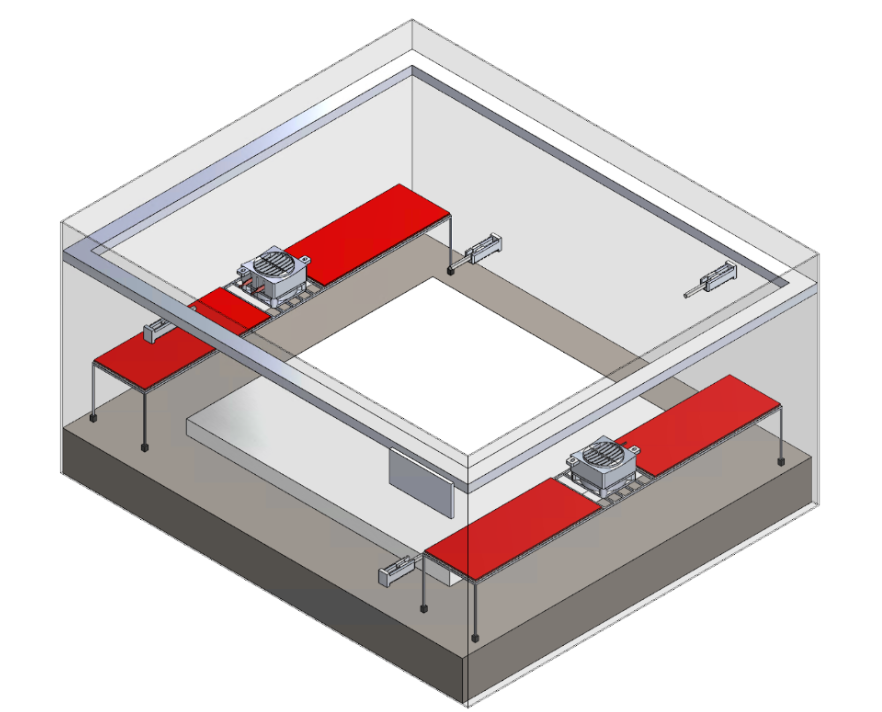
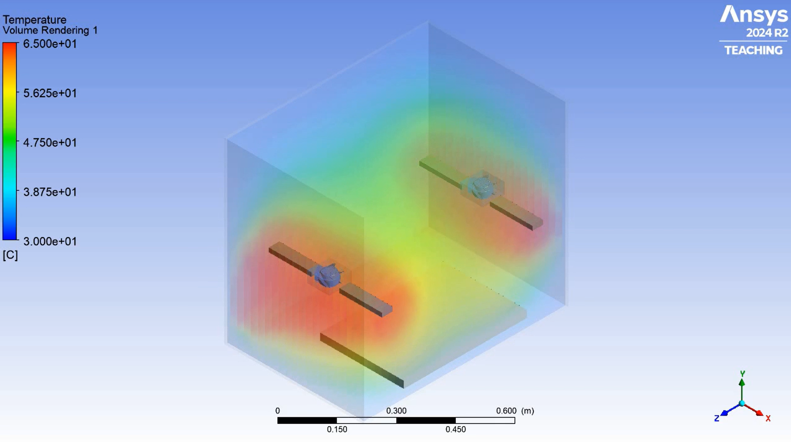
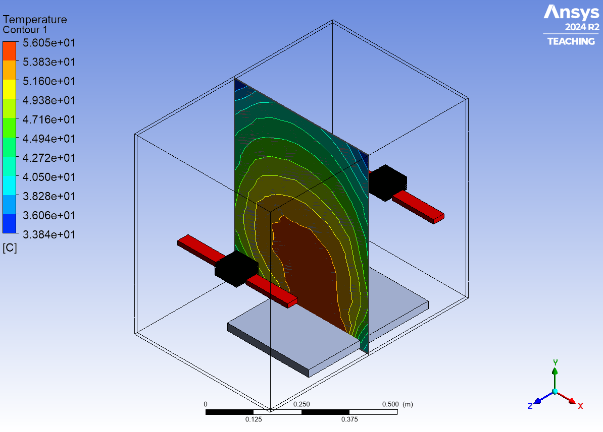
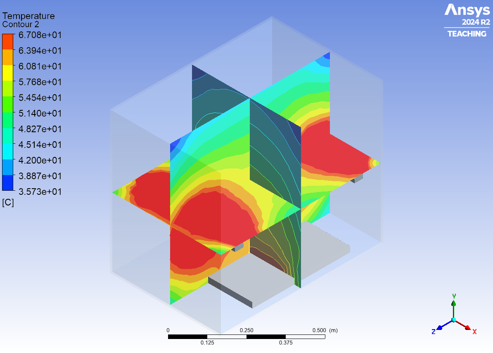
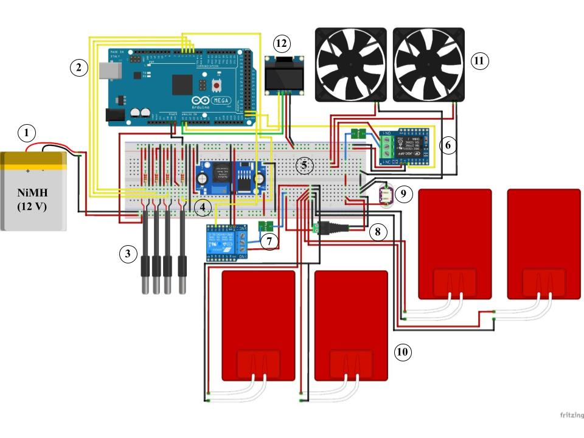

# 3D Printer Chamber Temperature Control System

**Objective:** Design and implement a controlled thermal environment for the Anisoprint Composer A3 FDM printer chamber.  

**Key Achievements:**  
- Developed a CAD model incorporating thermal management components in SolidWorks.  
- Performed CFD analysis in ANSYS Fluent to optimize airflow, heat transfer, and thermal uniformity.  

