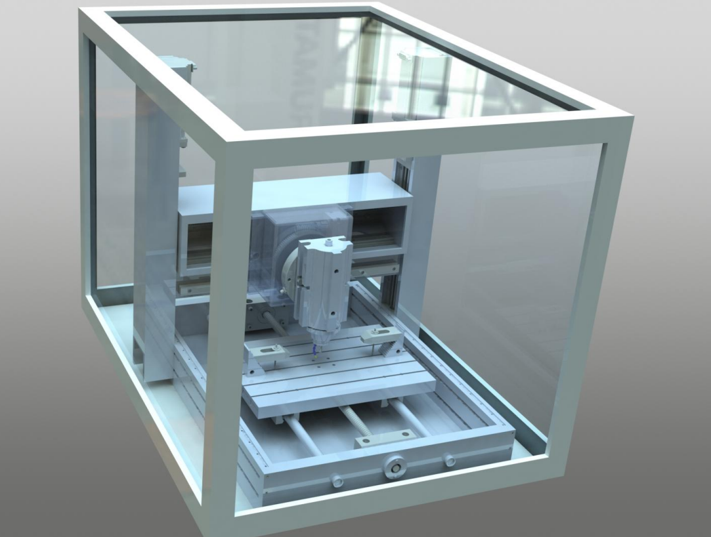

# Entry-Level Professional Desktop Milling Machine

**Objective:** Design and develop a 4-axis CNC milling machine for rapid prototyping and to enhance understanding of CNC systems.  

**Key Achievements:**  
- Modeled all mechanical components in SolidWorks.  
- Collaborated with a team of four to produce a complete CAD design, including a detailed 3D spindle assembly.  

  
