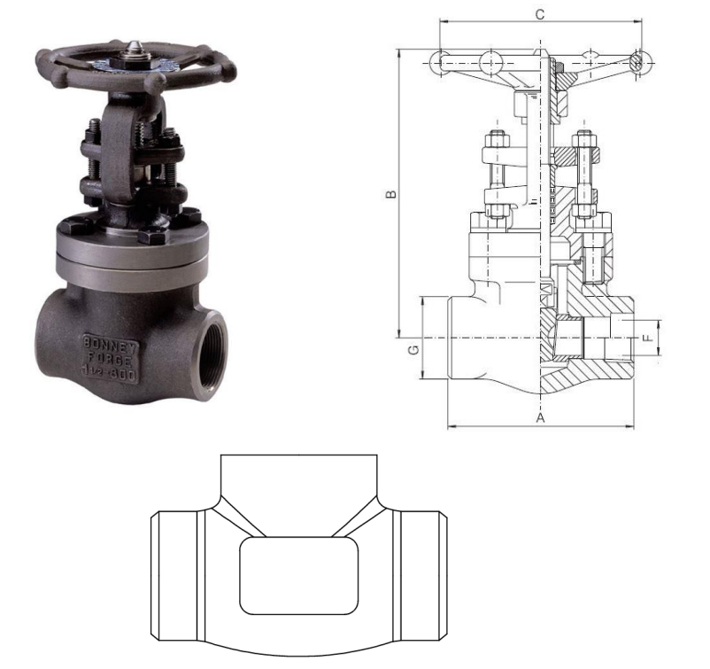
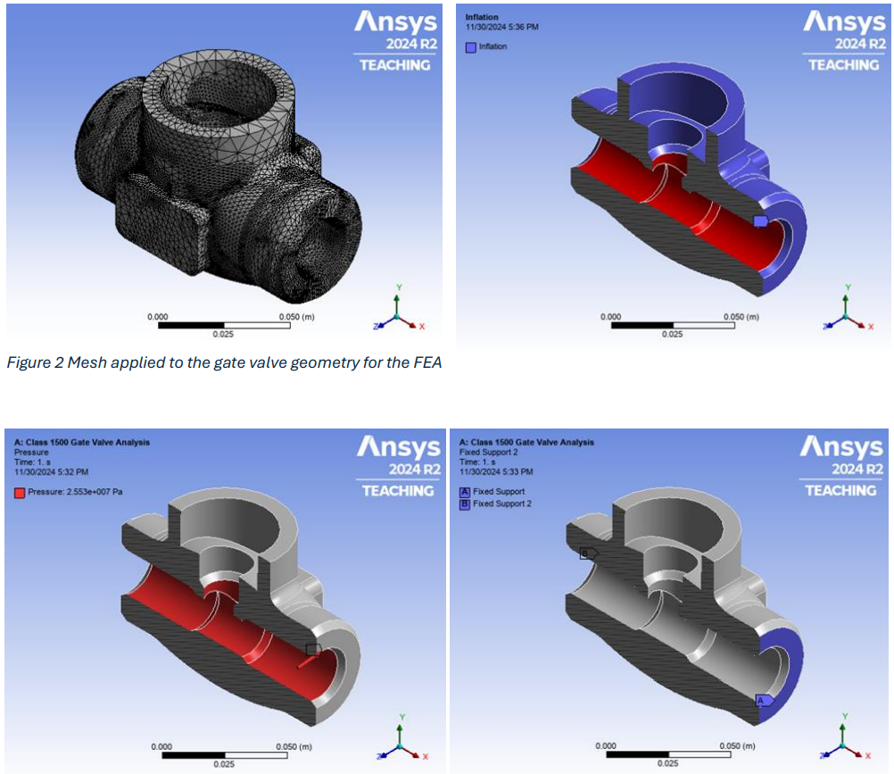
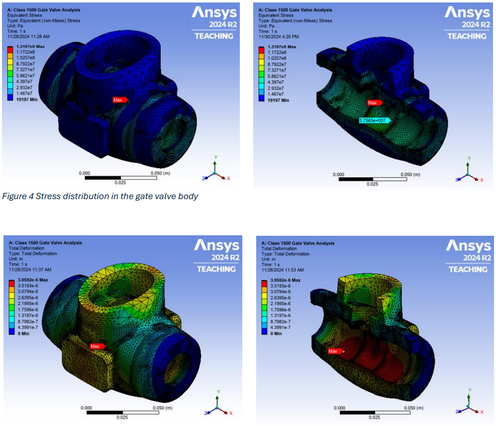

# High-Pressure Gate Valve Structural Analysis

**Objective:** Analyze the structural performance of a Class 1500, ¾” gate valve under high-pressure conditions.  

**Key Achievements:**  
- Modeled valve geometry in SolidWorks and performed FEA in ANSYS.  
- Identified stress concentrations at thin sections and recommended geometry modifications to improve reliability.  

